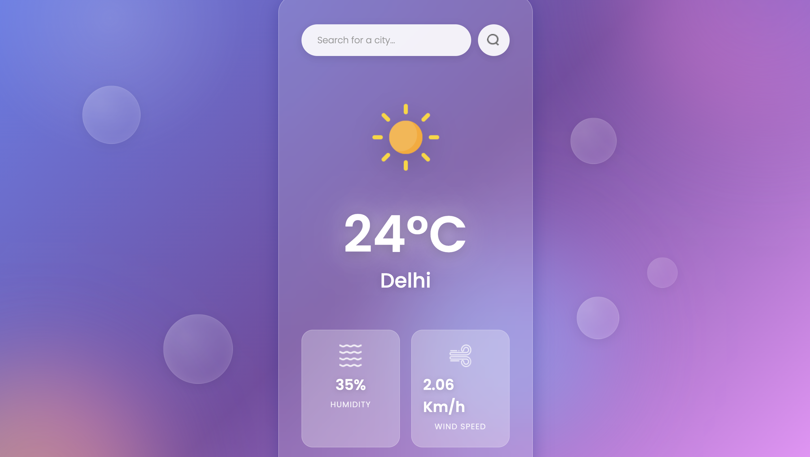

# 🌤️ Bhonpu App

A beautiful, modern weather application built with **React 19** and **Vite** that provides real-time weather information with an elegant, interactive user interface.

[](https://weather-three-inky.vercel.app/)
[](https://react.dev/)
[](https://vitejs.dev/)

🌐 **[View Live Demo →](https://weather-three-inky.vercel.app/)**

---

## ✨ Features

### 🔍 **Smart City Search**
- **Intelligent Autocomplete**: Real-time city suggestions as you type
- **Global Coverage**: Search any city worldwide with comprehensive location data
- **City Aliases**: Special support for city name variations (e.g., Prayagraj/Allahabad)
- **Priority Sorting**: Indian cities appear first in search results

### ⌨️ **Keyboard Navigation**
- Navigate suggestions using **Arrow Keys** (↑/↓)
- Select cities with **Enter**
- Close dropdown with **Escape**
- Full keyboard accessibility support

### 🎨 **Modern UI/UX**
- **Glassmorphic Design**: Beautiful frosted glass effect
- **Animated Cursor**: Custom cursor with sparkle particle effects
- **Floating Orbs**: Dynamic background animations
- **Smooth Transitions**: Fluid animations throughout
- **Responsive Layout**: Perfect on desktop, tablet, and mobile

### 🌡️ **Weather Information**
- Real-time temperature (°C)
- Current weather conditions with dynamic icons
- Humidity percentage
- Wind speed (km/h)
- Location display with country information

### ⚡ **Performance**
- **Lightning Fast**: Powered by Vite with instant HMR
- **Optimized Bundle**: Minimal load times
- **Efficient API Calls**: Smart debouncing and caching

---

## 📸 Screenshots



---

## 🚀 Getting Started

### Prerequisites

Before you begin, ensure you have the following installed:

- **Node.js** (v16.0 or higher) - [Download](https://nodejs.org/)
- **npm** (v7.0 or higher) - Comes with Node.js
- **OpenWeatherMap API Key** - [Get Free API Key](https://openweathermap.org/api)

### Installation

1. **Clone the repository**

   ```bash
   git clone https://github.com/your-username/weather-app.git
   cd weather-app
   ```

2. **Install dependencies**

   ```bash
   npm install
   ```

3. **Configure API Key**

   Create a `.env` file in the project root:

   ```bash
   touch .env
   ```

   Add your OpenWeatherMap API key:

   ```env
   VITE_APP_ID=your_api_key_here
   ```

   > **⚠️ Important**: Never commit your `.env` file to version control. It's already included in `.gitignore`.

4. **Start development server**

   ```bash
   npm run dev
   ```

   The app will be available at [http://localhost:5173](http://localhost:5173)

---

## 📦 Building for Production

Create an optimized production build:

```bash
npm run build
```

Preview the production build locally:

```bash
npm run preview
```

The optimized files will be generated in the `dist/` directory.

---

## 🏗️ Project Structure

```
Weather/
├── src/
│   ├── components/
│   │   ├── Weather.jsx        # Main weather component with search logic
│   │   └── Weather.css        # Component styling with animations
│   ├── assets/                # Weather icons and images
│   │   ├── clear.png
│   │   ├── cloud.png
│   │   ├── drizzle.png
│   │   ├── humidity.png
│   │   ├── rain.png
│   │   ├── search.png
│   │   ├── snow.png
│   │   └── wind.png
│   ├── App.jsx                # Main app component with cursor effects
│   ├── main.jsx               # React DOM entry point
│   └── index.css              # Global styles
├── public/                    # Static assets
├── .env                       # Environment variables (create this)
├── index.html                 # HTML template
├── vite.config.js             # Vite configuration
└── package.json               # Dependencies and scripts
```

---

## 🛠️ Technologies Used

| Technology | Purpose |
|------------|---------|
| [React 19](https://react.dev/) | UI Framework with latest features |
| [Vite](https://vitejs.dev/) | Next-generation build tool |
| [OpenWeatherMap API](https://openweathermap.org/api) | Real-time weather data |
| [Geolocation API](https://openweathermap.org/api/geocoding-api) | City search and autocomplete |
| CSS3 | Advanced animations and glassmorphism |
| [ESLint](https://eslint.org/) | Code quality and consistency |

---

## 🎯 Key Implementation Details

### Autocomplete System
- Fetches city suggestions from OpenWeatherMap Geocoding API
- Debounced search to minimize API calls
- Handles duplicate cities using coordinate-based deduplication
- Supports multiple search terms for city aliases

### Weather Data
- Uses OpenWeatherMap Current Weather API
- Displays temperature in Celsius (configurable)
- Dynamic weather icons based on condition codes
- Fallback handling for API errors

### UI Effects
- Custom cursor with particle trail
- Floating orb animations using CSS keyframes
- Glassmorphic design with backdrop filters
- Smooth dropdown transitions

---

## 📝 Available Scripts

| Command | Description |
|---------|-------------|
| `npm run dev` | Start development server with HMR |
| `npm run build` | Build optimized production bundle |
| `npm run preview` | Preview production build locally |
| `npm run lint` | Run ESLint to check code quality |

---

## 🔑 Getting Your API Key

1. Visit [OpenWeatherMap](https://openweathermap.org/)
2. Sign up for a free account
3. Navigate to **API Keys** section
4. Generate a new API key
5. Copy the key and add it to your `.env` file

> **Note**: Free tier includes 1,000 API calls per day, which is sufficient for personal use.

---

## 🚧 Troubleshooting

### API Key Issues

**Problem**: "Invalid API key" error

**Solution**: 
- Ensure your API key is correctly copied in `.env`
- Wait 10-15 minutes after generating a new API key (activation time)
- Verify the key format: `VITE_APP_ID=your_key_here` (no quotes)
- Restart the development server after adding the key

### City Not Found

**Problem**: City search returns no results

**Solution**:
- Try searching with different spellings
- Include country code (e.g., "London, UK")
- Check if the city name is in English
- Verify your internet connection

### Build Errors

**Problem**: Build fails or shows dependency errors

**Solution**:
```bash
# Clear cache and reinstall
rm -rf node_modules package-lock.json
npm install
npm run build
```

---

## 🌐 Deployment

This app is deployed on [Vercel](https://vercel.com/). To deploy your own instance:

### Deploy to Vercel

1. **Install Vercel CLI**
   ```bash
   npm install -g vercel
   ```

2. **Deploy**
   ```bash
   vercel
   ```

3. **Add Environment Variables**
   - Go to your project settings on Vercel
   - Add `VITE_APP_ID` with your API key

### Deploy to Netlify

1. **Build the project**
   ```bash
   npm run build
   ```

2. **Drag and drop** the `dist/` folder to [Netlify](https://app.netlify.com/drop)

3. **Add Environment Variables** in Site Settings

---

## 🤝 Contributing

Contributions are welcome! Here's how you can help:

1. **Fork the repository**
2. **Create a feature branch**
   ```bash
   git checkout -b feature/amazing-feature
   ```
3. **Commit your changes**
   ```bash
   git commit -m "Add amazing feature"
   ```
4. **Push to the branch**
   ```bash
   git push origin feature/amazing-feature
   ```
5. **Open a Pull Request**

---

## 📄 License

This project is open source and available under the [MIT License](LICENSE).

---

## 🙏 Acknowledgements

- **Weather Data**: [OpenWeatherMap](https://openweathermap.org/)
- **Icons**: Custom weather icons
- **Inspiration**: Modern weather applications and glassmorphic design trends
- **Community**: React and Vite communities for excellent documentation

---

## 📧 Contact & Support

If you have any questions or need support:

- 🐛 **Report bugs**: [Open an issue](https://github.com/your-username/weather-app/issues)
- 💡 **Feature requests**: [Start a discussion](https://github.com/your-username/weather-app/discussions)
- 📧 **Email**: your-email@example.com

---

<div align="center">

**⭐ Star this repository if you found it helpful!**

Made with ❤️ using React and Vite

[Report Bug](https://github.com/your-username/weather-app/issues) · [Request Feature](https://github.com/your-username/weather-app/issues)

</div>
